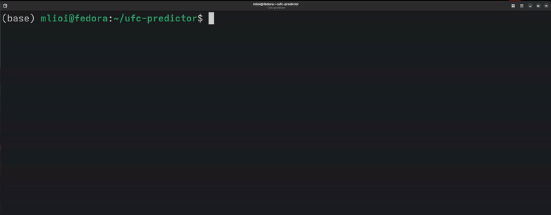

<h1 align="center">
  🥋 UFC Fight Predictor v2
  
</h1>

<p align="center">
  
  
  
</p>

## 📝 Project Summary
UFC Fight Predictor is a machine learning pipeline developed with AutoGluon to predict the outcomes of UFC fights by combining fighter statistics, performance history, and betting market signals.

---

> Check UFC Fight Predictor v1.0.

<p align="center">
  
</p>

---

## 🎯 Objective

UFC Fight Predictor v2 aims to build a robust **binary classification model** to predict the winner of a UFC fight.  
This version leverages **AutoGluon** for automated model selection and hyperparameter tuning, allowing for stronger baseline performance compared to the v1 models.

The pipeline combines detailed fighter and performance statistics with a custom **UFCStats scraper**, ensuring continuous updates after every UFC event.

---

## 📊 Dataset Description

### v2 Dataset (Current)

The updated dataset includes **over 8,000 UFC fights (2010–2025)** sourced from UFCStats.  
Each row represents a single bout with detailed per-fighter statistics, performance metrics, and fight context.

#### Key Feature Categories
- 🧍 **Fighter Attributes**  
  Height, reach, weight, stance, age, professional record.  
- 🎯 **Performance Metrics**  
  - Strikes landed/attempted by target area (head, body, legs).  
  - Striking accuracy and defense rates.  
  - Takedown attempts, accuracy, and defense.  
  - Submission attempts and control time.  
- 🏆 **Fight Context**  
  Event, location, date, division, rounds, title fight status.  
- ⚡ **Target Variable**  
  - **0** → Red Corner Win  
  - **1** → Blue Corner Win  

---

⚙️ With this enriched dataset and AutoGluon integration, UFC Fight Predictor v2 delivers **improved accuracy and adaptability** for real-time UFC fight predictions.

---

## 🛠️ Modeling Approach

The modeling pipeline is structured into three interconnected stages, designed to maximize predictive performance while ensuring interpretability and robustness, all preprocessing, feature engineering, and data splitting is handled via the modular UFCData class, ensuring consistent transformations across training and evaluation. All models are wrapped and evaluated through the UFCModel class.

1. **🔧 Feature Engineering**

   - A synthetic random noise feature (`Random_Noise`) is introduced as a baseline to assess feature importance. Different combinations were explored until the random column gained prominence, guiding the final selection. This iterative process resulted in a feature set that balances complexity, interpretability, and predictive power.

2. **🤖 Model Training**

   - The task is framed as a binary classification problem, with a baseline distribution of approximately 58% red corner wins, reflecting historical outcome imbalance.

3. **📊 Evaluation**
   - Model performance is assessed using a comprehensive set of metrics, computed via the modular `metrics.py` implementation:
     - **Accuracy** (0–1, higher is better): Overall proportion of correct predictions.
     - **Precision** (0–1, higher is better): Share of positive predictions that are actually correct.
     - **Recall** (0–1, higher is better): Share of true positives correctly identified.
     - **F1 Score** (0–1, higher is better): Harmonic mean of precision and recall, balancing both.
     - **ROC-AUC** (0.5–1, higher is better): Probability that the model ranks a random positive higher than a random negative.
     - **Brier Score** (0–1, lower is better): Mean squared error between predicted probabilities and actual outcomes, reflecting calibration.
   - Confusion matrices are used to visualize classification performance across true and false positives and negatives.
   - The framework supports automated multi-model comparison, enabling the identification of top-performing models per metric and facilitating robust benchmarking.

---

## 🤖 Models Implemented

## 🧠 Feature Importance Analysis (With vs. Without Odds)

A comparative analysis of feature importance across models trained **with** and **without** betting odds reveals key shifts in predictive behavior.

### 🔍 Models Trained Without Odds

---

### 🔍 Models Trained With Odds

---

### 🧩 Conclusion

- Without odds, models must infer advantage purely from physical and statistical differences between fighters.
- With odds, models gain access to a **powerful proxy of market knowledge**, which reflects public perception, fighter form, injury rumors, and expert insights—all aggregated into a single feature.
- This results in higher predictive accuracy and more calibrated outputs, but also **reduces model reliance on handcrafted features**.

> Betting odds act as a real-world prior, dramatically enhancing model confidence—but at the cost of reduced interpretability and generalization when odds are unavailable.

## 📊 Model Performance Summary

## 📈 Model Performance Summary (No Odds)

> 📌 *Complete results and additional visualizations can be inspected in `notebooks/05-model_experiments.ipynb`.*

---

### 📊 Metrics Analysis and Predictive Limits

## 🧩 Feature Descriptions

## 🔬 Noise-Based Feature Selection

To improve feature selection, we conducted a **Noise-Based Feature Selection** experiment. A synthetic random feature (`Random_Noise`) was added to the dataset using `UFCData.add_random_feature()`, and feature importance was analyzed across multiple models. Any real feature showing lower importance than the random column was considered uninformative and a candidate for exclusion.

This iterative process helped refine the feature set, striking a balance between **model complexity, interpretability, and predictive performance**.  
**Below: on the left, feature importances with the random noise benchmark; on the right, after applying several feature engineering refinements, with the random noise column removed:**

---

🛠️🚧 Under Construction

## 🚀 Getting Started

You can interact with UFC Fight Predictor v2 in two ways:

---

### 🧪 Run the pipeline via notebooks

1. **Clone the repository**

```bash
git clone https://github.com/mfourier/ufc-predictor-v2.git
cd ufc-predictor
```

2. **Install dependencies**

```bash
pip install -r requirements.txt
```

3. **Run the pipeline notebooks**

Follow the workflow step by step:

- `notebooks/01-etl.ipynb` → Data cleaning and preparation  
- `notebooks/02-eda.ipynb` → Exploratory data analysis  
- `notebooks/03-feature_engineering.ipynb` → Feature construction  
- `notebooks/04-training.ipynb` → Model training and tuning  
- `notebooks/05-model_experiments.ipynb` → Evaluation and comparison  

---

## 🧪 Project Structure

```bash
ufc-predictor/
├── app.py                            # Main entry point
├── data/
│   ├── raw/                          # Original fight data
│   ├── processed/                    # Cleaned and transformed datasets
│   └── results/                      # Evaluation logs, metrics, model reports
├── notebooks/
│   ├── 01-etl.ipynb                  # Data extraction and cleaning
│   ├── 02-eda.ipynb                  # Exploratory Data Analysis
│   ├── 03-feature_engineering.ipynb  # Feature engineering using UFCData
│   ├── 04-training.ipynb             # Model training using the training set
│   ├── 05-model_experiments.ipynb    # Model comparison and results analysis
│   └── 06-deployment.ipynb           # Deployment exploration and integration
├── src/
│   ├── config.py                     # Model hyperparameters and registry
│   ├── data.py                       # UFCData class: manages data splits and transformations
│   ├── helpers.py                    # Utility and preprocessing functions
│   ├── io_model.py                   # Save/load model objects from disk
│   ├── metrics.py                    # Evaluation metrics and plots
│   ├── model.py                      # UFCModel class: Wrapper class for saving, loading, and evaluating models
│   ├── model_factory.py              # Central model selection logic
│   └── predictor.py                  # UFCPredictor class: interactive fight prediction interface
├── docs/                             # Markdown documentation per model
├── img/                              # Images for plots, logos, and visuals
└── requirements.txt                  # Project dependencies

```

---

## 📚 Documentation

Comprehensive project documentation is available in the `docs/` folder, covering:

- **Model overviews and mathematical formulations**: Detailed descriptions of each algorithm, including underlying principles and expected behavior.
- **Key assumptions and limitations**: Insights into when and why each model performs best, as well as potential pitfalls.
- **Training logs**: A CSV file automatically generated during experiments, storing key metrics, best hyperparameters, and training durations for each model, enabling result tracking and comparison across runs.
- **Usage guides**: Step-by-step instructions on running the notebooks, customizing experiments, and interpreting results.

---

## 👥 Contributors

- **Maximiliano Lioi** — M.Sc. in Applied Mathematics @ University of Chile
- **Rocío Yáñez** — M.Sc. in Applied Mathematics @ University of Chile

---

### Disclaimer

This project is an independent work for academic and research purposes.  
It is not affiliated with, endorsed by, or sponsored by UFC, Zuffa LLC, or any related entity.  
All trademarks and fight data belong to their respective owners.

