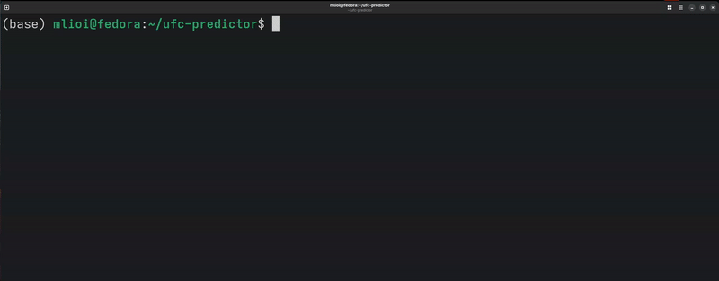

<h1 align="center">
  🥋 UFC Fight Predictor v2
  
</h1>

<p align="center">
  
  
</p>

## 📝 Project Summary
UFC Fight Predictor is a machine learning pipeline developed with AutoGluon to predict the outcomes of UFC fights by combining fighter statistics, performance history, and betting market signals.

---

> Check UFC Fight Predictor v1.0.

<p align="center">
  
</p>

---

## 🎯 Objective

It builds upon [v1](https://github.com/mfourier/ufc-predictor) by incorporating:
- A richer **historical feature engine** (`build_history_features`) with EMA, last-N, and career averages.
- A robust **data preparation interface** (`prepare_modeling_df`) for flexible column management and difference features.
- A dedicated **UFCData** class to handle splits, scaling, encoding, and correlation analysis.  

This version leverages **AutoGluon** for automated model selection and hyperparameter tuning, allowing for stronger baseline performance compared to the v1 models.

---

## 📊 Dataset Description

### v2 Dataset (Current)

The updated dataset includes **over 8,000 UFC fights (2010–2025)** sourced from UFCStats.  
Each row represents a single bout with detailed per-fighter statistics, performance metrics, and fight context.

#### 🔑 Feature Categories
- 🧍 **Fighter Attributes**: age, height, reach, stance, pro record, etc.  
- 📈 **Performance History** (via `build_history_features`):  
  - Strikes landed/absorbed per minute.  
  - Accuracy & defense rates (striking, takedowns, subs).  
  - Last-*N*, career, and EMA averages.  
- 🥋 **Fight Context**: division, time since last fight, time since debut, etc. 
- ⚡ **Target Variable**  
  - **0** → Red Corner Win  
  - **1** → Blue Corner Win  

---

⚙️ With this enriched dataset and AutoGluon integration, UFC Fight Predictor v2 delivers **improved accuracy and adaptability** for real-time UFC fight predictions.

---

## ⚙️ Pipeline Overview

### 🔧 Feature Engineering
- `prepare_modeling_df` ensures consistent difference features, customizable keeps/skips, and safe dropping of columns.  
- Historical stats are leakage-free, computed only with fights **prior** to the bout.  

### 🤖 Model Training
- Automated model selection & tuning with **AutoGluon**.  


## 🚀 Getting Started

You can interact with UFC Fight Predictor v2 in two ways:

---

## 🧪 Run the pipeline via notebooks

1. **Clone the repository**

```bash
git clone https://github.com/mfourier/ufc-predictor-v2.git
cd ufc-predictor
```

2. **Install dependencies**

```bash
pip install -r requirements.txt
```

3. **Run the pipeline notebooks**

Follow the workflow step by step:

- `notebooks/01-etl.ipynb` → Data cleaning and preparation  
- `notebooks/02-eda.ipynb` → Exploratory data analysis  
- `notebooks/03-feature_engineering.ipynb` → Feature construction  
- `notebooks/04-training.ipynb` → Model training and tuning  
- `notebooks/05-model_experiments.ipynb` → Evaluation and comparison  

---

## 🧪 Project Structure

```bash
ufc-predictor-v2/
├── data/
│   ├── raw/                          # Original fight data
│   └──processed/                    # Cleaned and transformed datasets
├── notebooks/
│   ├── 00-scraping.ipynb             # Data scraping
│   ├── 01-etl.ipynb                  # Data extraction and cleaning
│   ├── 02-eda.ipynb                  # Exploratory Data Analysis
│   ├── 03-feature_engineering.ipynb  # Feature engineering using UFCData
│   ├── 04-training.ipynb             # Model training using the training set
├── src/
│   ├── data.py                       # UFCData class: manages data splits and transformations
│   └── helpers.py                    # Utility and preprocessing functions
├── img/                              # Images for plots, logos, and visuals
└── requirements.txt                  # Project dependencies

```

## 👥 Contributors

- **Maximiliano Lioi** — M.Sc. in Applied Mathematics @ University of Chile

## 🙏 Acknowledgments

Special thanks to **Aditya Ratan** for scraping [UFCStats](http://ufcstats.com/) and making the dataset publicly available on Kaggle:  
[UFC Datasets 1994–2025](https://www.kaggle.com/datasets/neelagiriaditya/ufc-datasets-1994-2025/discussion/593848)  

His contribution greatly facilitated the data collection process for this project.

## Disclaimer

This project is an independent work for academic and research purposes.  
It is not affiliated with, endorsed by, or sponsored by UFC, Zuffa LLC, or any related entity.  
All trademarks and fight data belong to their respective owners.

